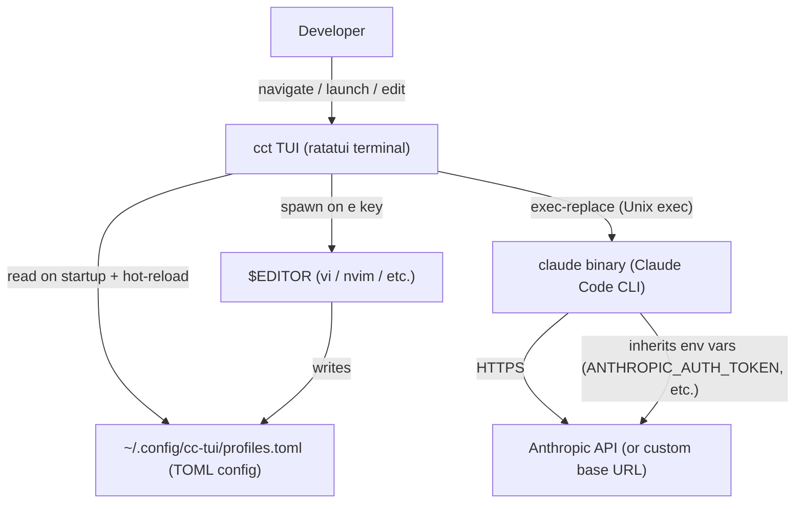

# cct — Architecture Document

<!-- BEGIN:architecture -->

## Project Overview

- **Problem Domain**: `cct` is a terminal UI launcher for Claude Code. It lets users define named "profiles" (different Claude model configs, API keys, extra flags) in a single TOML file and select them via an interactive ratatui TUI, replacing the need to manually construct long `claude ...` command lines.
- **Primary Users**: Individual developers who run Claude Code locally across multiple configurations (e.g., different models, API providers, permission modes).

## Tech Stack

| Item | Value |
|------|-------|
| Language | Rust (edition 2021) |
| TUI Framework | ratatui 0.29 + crossterm 0.28 |
| Config Serialization | serde + toml 0.8 |
| Path Utilities | dirs 5 |
| Error Handling | anyhow 1 |
| Build Tool | Cargo |
| Runtime | Native Unix binary (no runtime, exec-replacement) |
| CI | GitHub Actions (lint + test on push/PR; release on tag) |

## Architecture Pattern

**Flat single-binary CLI with 4 focused modules** — no shared mutable global state. The architecture is closer to a classic Unix filter than to a server application:

```
Config (TOML) → App (cursor state) → UI (ratatui draw loop) → Launch (exec-replace)
```

Each module has no circular dependency; `launch` and `ui` both depend on `config::Profile` but not on each other.

## Core Modules (First-level)

| Module | File | Responsibility |
|--------|------|----------------|
| `config` | `src/config.rs` | Deserialize `profiles.toml` via serde/toml; write default config on first run; append new profiles with auto-generated `[profiles.env]` |
| `app` | `src/app.rs` | Cursor state (`selected` index), list navigation (`next`/`prev`), `AppMode` (Normal/AddForm), 5-field `FormState` for inline add form |
| `ui` | `src/ui.rs` | ratatui rendering — 35/65 split list+detail/form panel + footer; masks sensitive env vars; `AppMode`-dispatched rendering |
| `launch` | `src/launch.rs` | Build `claude` CLI args from a profile; `exec()` the process (Unix process replace); open `$EDITOR` |
| `cli` | `src/cli.rs` | `cct add` interactive CLI subcommand — 5 prompts (name, description, base\_url, api\_key, model), masked summary, duplicate guard |

## Critical Path

### Startup Flow
```
src/main.rs (entry point)
  → config::ensure_default_config()   # create ~/.config/cc-tui/profiles.toml if absent
  → launch::check_claude_installed()  # `which claude` — false if missing
      → [if missing] launch::prompt_install()
          → prompt "Install now? [Y/n]"
          → [Y] run `curl -fsSL https://claude.ai/install.sh | bash`
          → re-check PATH + ~/.local/bin fallback → exit 1 on unresolvable failure
  → config::load_profiles()           # parse TOML → Vec<Profile>
  → crossterm: enable_raw_mode + EnterAlternateScreen
  → App::new(profiles)                # initialize cursor at index 0, mode = Normal
  → loop:
      tui.draw(|f| ui::draw(&app, f)) # render list + detail/form + footer
      event::read()                    # block on keypress
```

### Main Use Case — Launch Profile
```
User presses [Enter] (mode = Normal)
  → launch::restore_terminal()        # disable raw mode, LeaveAlternateScreen
  → launch::exec_claude(&profile)
      → env::set_var(k, v) for each profile.env entry
      → launch::build_args(profile)   # --model, --dangerously-skip-permissions, extra_args
      → Command::new("claude").args(...).exec()  # Unix exec — process replaced, no return
```

### Add Profile — TUI Form (key `a`)
```
User presses [a] (mode = Normal)
  → app.mode = AppMode::AddForm(FormState::new())
  → TUI renders 5-field form (Name *, Description, Base URL, API Key, Model)
  → User fills fields (Tab/↑↓ navigate, Backspace edits)
  → User presses [Enter] on last field → form.confirming = true
  → TUI shows confirmation summary (API Key masked via mask_value)
  → User presses [y]
      → config::profile_name_exists(name) guard
      → config::append_profile(&NewProfile { name, description, base_url, api_key, model })
          → writes [[profiles]] block + [profiles.env] (if any env field non-empty)
      → config::load_profiles()       # reload to pick up new profile
      → app.selected = index of new profile
      → app.mode = AppMode::Normal
```

### Add Profile — CLI (`cct add`)
```
cct add
  → cli::run_add()
      → 5 sequential prompts (name required, rest optional)
      → duplicate name check via config::profile_name_exists
      → masked summary display (API Key shown as "sk-1...key4")
      → Save? (y/n) confirmation
      → config::append_profile(&NewProfile { ... })
```

### Toggle skip_permissions (key `s`)
```
User presses [s] (mode = Normal, profiles non-empty)
  → compute new_val = !profile.skip_permissions.unwrap_or(false)
  → config::toggle_skip_permissions(&profile.name, new_val)
      → parse TOML with toml_edit::DocumentMut (preserves comments)
      → set entry["skip_permissions"] = new_val
      → write file
  → [Ok] app.profiles[selected].skip_permissions = Some(new_val)
      → UI re-renders: row turns red (true) or normal (false)
  → [Err] eprintln warning; app state unchanged
```

### Hot-reload Config (key `e`)
```
User presses [e]
  → launch::restore_terminal()
  → launch::open_editor(&config_path())   # blocks until $EDITOR exits
  → crossterm: re-enable raw mode
  → config::load_profiles()              # re-parse TOML in-place
  → update app.profiles + clamp cursor
```

## Configuration-Driven Logic

| Config Source | Effect |
|--------------|--------|
| `~/.config/cc-tui/profiles.toml` (default) | Main profile store; location overridable via `CCT_CONFIG` env var |
| `CCT_CONFIG` env var | Override config file path (used by integration tests) |
| `CCT_CLAUDE_BIN` env var | Override binary name used by `check_claude_installed` (used by unit tests to substitute `"true"` or a nonexistent binary) |
| `$EDITOR` env var | Editor opened on `e` key; falls back to `vi` |
| `profiles[].model` | Adds `--model <value>` to `claude` invocation |
| `profiles[].skip_permissions = true` | Adds `--dangerously-skip-permissions` to `claude` invocation |
| `profiles[].extra_args = [...]` | Appended verbatim after other flags |
| `profiles[].env.*` | Injected as process environment variables before exec |
| Add-flow `base_url` → `ANTHROPIC_BASE_URL` | Auto-written to `[profiles.env]` by `append_profile` |
| Add-flow `api_key` → `ANTHROPIC_API_KEY` | Auto-written to `[profiles.env]` by `append_profile` |
| Add-flow `model` → 5 model alias env vars + `API_TIMEOUT_MS` + `CLAUDE_CODE_DISABLE_NONESSENTIAL_TRAFFIC` | Auto-written to `[profiles.env]` by `append_profile` when model is non-empty |
| `CCT_LIVE_TESTS=1` | Enables the live E2E test suite (requires real `claude` binary) |
| `CCT_TEST_TOML` | Integration test: override config path for subprocess exec test |
| `CCT_TEST_ARGS_FILE` | Integration test: fake `claude` stub writes captured args here |

## System Context Diagram



## Test Infrastructure

| Suite | Location | Description |
|-------|----------|-------------|
| Unit tests | `src/config.rs`, `src/ui.rs`, `src/launch.rs` (inline `#[cfg(test)]`) | Config parsing, arg building, masking, toggle, install check |
| Integration (mock) | `tests/integration.rs` | Uses a fake `claude` shell script at `tests/helpers/claude` |
| Integration (live) | `tests/live.rs` | Requires `CCT_LIVE_TESTS=1` and real `claude` binary |
| Shell (BATS) | `tests/install.bats` | Tests `install.sh` functions in isolation using `export -f` stubbing |

## Key Design Decisions

- **`exec` not `spawn`**: `launch::exec_claude` uses Unix `exec` so `claude` inherits the terminal cleanly; there is no return path on success.
- **`ui::mask_value`**: Redacts any env key containing `TOKEN`, `KEY`, or `SECRET` in the detail panel and add-form confirmation.
- **Config hot-reload on `e`**: Editor opens, then profiles are re-parsed in-place without process restart.
- **No shared mutable state**: Each module is self-contained; `App` owns `Vec<Profile>` and is the single source of truth for cursor position and UI mode.
- **Auto-env-var generation on add**: When `base_url`, `api_key`, or `model` are provided in the add flow, `config::append_profile` generates a complete `[profiles.env]` block covering all Anthropic env var names needed for third-party endpoints, avoiding manual configuration errors.
- **Dual add surface (CLI + TUI)**: `cct add` (CLI) and `a` key (TUI) both funnel through `config::append_profile`, keeping the TOML serialization logic in one place.
- **Autoinstall on startup**: `main` calls `launch::check_claude_installed()` before entering the TUI. If `claude` is absent, `prompt_install()` offers to run `curl -fsSL https://claude.ai/install.sh | bash` interactively. This must happen before raw mode is enabled.
- **`toml_edit` for surgical writes**: `config::toggle_skip_permissions` uses `toml_edit::DocumentMut` rather than re-serializing the entire config, so user comments and key ordering are preserved on every toggle.
- **`skip_permissions` red visual indicator**: Profile list rows are rendered in `Color::Red` when `skip_permissions = true`, providing an immediate danger signal in the TUI without requiring the user to open the detail panel.
- **`install.sh` curl|bash installer**: A standalone Bash script at the repo root downloads the latest GitHub Release tarball, verifies it with `tar -tzf`, retries up to 3 times on download failure, and installs to `~/.local/bin`. Does not require root.

<!-- END:architecture -->
