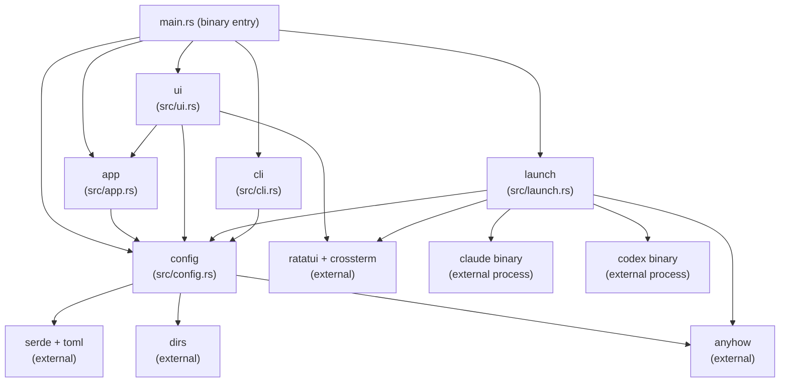

# cct — Module Documentation Index

## Project Summary

One-line summary: `cct` is a Rust terminal UI launcher that reads Claude Code and OpenAI Codex profiles from a TOML config file and exec-replaces itself with `claude <args>` or `codex [--full-auto]` when the user selects a profile.

## Key Statistics

- First-level modules: **5** (config, app, ui, launch, cli)
- Total public interface points: **~35** (8 types/structs/enums + ~27 functions/methods)
- Key external dependencies: `ratatui`, `crossterm`, `serde`, `toml`, `dirs`, `anyhow`

## System Architecture Overview

Five-module flat architecture with unidirectional data flow and no shared mutable state:

```
config (leaf) ─→ app ─→ ui
                    └─→ launch
cli ─────────────→ config
```

`config` is the leaf (no internal deps). `app`, `ui`, `launch`, and `cli` each depend on `config`. `ui` additionally depends on `app`. There are no circular dependencies.

---

<!-- BEGIN:module-index -->
## Module Index

| Module | Doc Path | Primary Responsibility | Depends On |
|--------|----------|----------------------|------------|
| `config` | [docs/modules/config.md](config.md) | TOML deserialization, `Backend` enum, validation, config path resolution, profile append for Claude and Codex backends | *(leaf — no internal deps)* |
| `app` | [docs/modules/app.md](app.md) | Cursor state, backend-filtered navigation (`filtered_indices`, `switch_backend`), `AppMode`, 5-field `FormState` with `to_new_profile()` as single source of truth | `config::Profile`, `config::Backend`, `config::NewProfile` |
| `ui` | [docs/modules/ui.md](ui.md) | ratatui rendering: tab bar + 35/65 split filtered list + detail panel + footer; inline add-form with backend-aware `field_labels`; sensitive-value masking | `app::App`, `app::AppMode`, `app::FormState`, `app::field_labels`, `app::Backend`, `config::Profile` |
| `launch` | [docs/modules/launch.md](launch.md) | Build CLI args for Claude and Codex; generate codex config.toml; Unix exec-replace; open `$EDITOR`; restore terminal | `config::Profile`, `config::Backend` |
| `cli` | *(inline in src/cli.rs)* | `cct add` interactive CLI flow: 5 prompts, masked API key summary, duplicate guard | `config::NewProfile`, `config::profile_name_exists`, `config::append_profile` |
<!-- END:module-index -->

---

<!-- BEGIN:dependency-graph -->
## Dependency Graph



**Notes**:
- `config` is the only leaf module; it has no internal imports.
- `ui`, `launch`, and `cli` all consume `config` exports but are independent of each other.
- `main.rs` is the only orchestrator; no module calls a sibling module (except `ui` → `app`).
- No circular dependencies exist.
<!-- END:dependency-graph -->

---

<!-- BEGIN:interface-index -->
## Global Interface Index

### config module (`src/config.rs`)

- `enum Backend` — `Claude` (default) | `Codex`; serde rename lowercase; used in `Profile`, `NewProfile`, `App`, `FormState`, `launch`
- `struct Profile` — deserialized profile (name, description, backend, base_url, full_auto, model, skip_permissions, extra_args, env)
- `struct NewProfile` — input for profile creation (name, description, base_url, api_key, model, backend, full_auto)
- `fn config_path() -> PathBuf` — resolves config file path (`CCT_CONFIG` env var → XDG dirs)
- `fn ensure_default_config() -> Result<()>` — creates default TOML on first run (idempotent)
- `fn validate_profiles(profiles: &[Profile]) -> Result<()>` — rejects illegal field combinations (codex+skip_perms, claude+full_auto)
- `fn load_profiles() -> Result<Vec<Profile>>` — reads, parses, and validates the TOML file
- `fn profile_name_exists(name: &str) -> Result<bool>` — case-insensitive duplicate check
- `fn append_profile(profile: &NewProfile) -> Result<()>` — appends `[[profiles]]` + backend-specific env block

### app module (`src/app.rs`)

- `fn field_labels(backend: &Backend) -> [&'static str; 5]` — backend-specific label arrays for the add form
- `const FIELD_LABELS: [&str; 5]` — Claude-default labels (legacy; prefer `field_labels`)
- `enum AppMode` — `Normal` | `AddForm(FormState)` — discriminates TUI modes
- `struct FormState { fields: [String; 5], active_field: usize, confirming: bool, error: Option<String>, backend: Backend }` — add-form transient state
- `fn FormState::new() -> Self` — construct empty form (backend defaults to Claude)
- `fn FormState::next_field(&mut self)` — advance field cursor (clamped at 4)
- `fn FormState::prev_field(&mut self)` — retreat field cursor (clamped at 0)
- `fn FormState::to_new_profile(&self) -> NewProfile` — **single source of truth** for field-index → semantic mapping
- `struct App { profiles: Vec<Profile>, selected: usize, mode: AppMode, active_backend: Backend }` — sole mutable TUI state owner
- `fn App::new(profiles: Vec<Profile>) -> Self` — constructs with `selected = 0`, `mode = Normal`, `active_backend = Claude`
- `fn App::filtered_indices(&self) -> Vec<usize>` — indices of profiles matching `active_backend`
- `fn App::switch_backend(&mut self, backend: Backend)` — sets active_backend and resets selected to 0
- `fn App::next(&mut self)` — advance cursor within filtered subset (wraps, no-op if empty)
- `fn App::prev(&mut self)` — retreat cursor within filtered subset (wraps, no-op if empty)

### ui module (`src/ui.rs`)

- `fn mask_value<'a>(key: &str, val: &'a str) -> &'a str` — returns `"***"` for TOKEN/KEY/SECRET keys
- `fn draw(app: &App, frame: &mut Frame)` — full TUI render (tab bar + list + detail/form + footer); dispatches on `app.mode` and `app.active_backend`

### launch module (`src/launch.rs`)

- `fn restore_terminal()` — disable raw mode, leave alternate screen (errors suppressed)
- `fn build_args(profile: &Profile, with_continue: bool) -> Vec<String>` — pure Claude arg builder
- `fn build_launch_command(profile: &Profile, with_continue: bool) -> (String, Vec<String>)` — pure dispatch to correct binary + arg builder
- `fn exec_claude(profile: &Profile, with_continue: bool) -> anyhow::Error` — injects env vars, exec-replaces with claude
- `fn check_codex_installed() -> bool` — `which codex` availability check
- `fn generate_codex_config(profile: &Profile, codex_home: &Path) -> anyhow::Result<()>` — writes config.toml for codex
- `fn build_codex_args(profile: &Profile) -> Vec<String>` — pure Codex arg builder (--full-auto, extra_args; no --model)
- `fn exec_codex(profile: &Profile) -> anyhow::Error` — generates config.toml, sets CODEX_HOME, injects env, exec-replaces with codex
- `fn check_claude_installed() -> bool` — availability check (supports CCT_CLAUDE_BIN override for tests)
- `fn prompt_install() -> Result<()>` — interactive installer prompt for missing claude binary
- `fn open_editor(path: &Path) -> Result<()>` — spawns `$EDITOR` (fallback: `vi`), blocks until exit

### cli module (`src/cli.rs`)

- `fn run_add() -> Result<()>` — entry point for `cct add`; delegates to `run_add_with(stdin, stdout)`
- `fn run_add_with<R: BufRead, W: Write>(reader, writer) -> Result<()>` — testable 5-prompt interactive flow; always creates `Backend::Claude` profiles
<!-- END:interface-index -->

---

## Cross-Reference Consistency Check

| Claim | Verified |
|-------|----------|
| `app` depends on `config::Profile`, `config::Backend`, `config::NewProfile` | ✅ — verified in `src/app.rs` use statement |
| `ui` depends on `app::{App, AppMode, FormState, FIELD_LABELS, field_labels, Backend}` and `config::Profile` | ✅ — verified in `src/ui.rs` use statement |
| `launch` depends on `config::Profile` and `config::Backend` | ✅ — verified in `src/launch.rs` use statement |
| `cli` depends on `config::{self, NewProfile}` | ✅ — verified in `src/cli.rs` use statement |
| No circular dependencies | ✅ — `config` is a pure leaf, others are consumers |
| No orphan modules | ✅ — all 5 modules are referenced from `src/lib.rs` and used by `main.rs` |
| `field_labels(backend)` and `FormState::to_new_profile()` use the same field index convention | ✅ — both live in `app.rs`; regression tests assert label[i] matches mapping[i] per backend |
