# cct — Module Documentation Index

## Project Summary

One-line summary: `cct` is a Rust terminal UI launcher that reads Claude Code profiles from a TOML config file and exec-replaces itself with `claude <args>` when the user selects a profile.

## Key Statistics

- First-level modules: **4**
- Total public interface points: **14** (4 types/structs + 10 functions)
- Key external dependencies: `ratatui`, `crossterm`, `serde`, `toml`, `dirs`, `anyhow`

## System Architecture Overview

Four-module flat architecture with unidirectional data flow and no shared mutable state:

```
config (leaf) ─→ app ─→ ui
                    └─→ launch
```

`config` is the leaf (no internal deps). `app`, `ui`, and `launch` each depend on `config::Profile`. `ui` additionally depends on `app::App`. There are no circular dependencies.

---

<!-- BEGIN:module-index -->
## Module Index

| Module | Doc Path | Primary Responsibility | Depends On |
|--------|----------|----------------------|------------|
| `config` | [docs/modules/config.md](config.md) | TOML deserialization, default config bootstrap, config path resolution | *(leaf — no internal deps)* |
| `app` | [docs/modules/app.md](app.md) | Cursor state (`selected`) and circular list navigation (`next`/`prev`) | `config::Profile` |
| `ui` | [docs/modules/ui.md](ui.md) | ratatui rendering: 35/65 split list+detail panel + footer; sensitive-value masking | `app::App`, `config::Profile` |
| `launch` | [docs/modules/launch.md](launch.md) | Build `claude` CLI args; Unix exec-replace; open `$EDITOR`; restore terminal | `config::Profile` |
<!-- END:module-index -->

---

<!-- BEGIN:dependency-graph -->
## Dependency Graph

```mermaid
graph TD
    main["main.rs (binary entry)"]
    config["config\n(src/config.rs)"]
    app["app\n(src/app.rs)"]
    ui["ui\n(src/ui.rs)"]
    launch["launch\n(src/launch.rs)"]
    serde["serde + toml\n(external)"]
    ratatui["ratatui + crossterm\n(external)"]
    dirs["dirs\n(external)"]
    anyhow["anyhow\n(external)"]
    claude["claude binary\n(external process)"]

    main --> config
    main --> app
    main --> ui
    main --> launch
    app --> config
    ui --> app
    ui --> config
    ui --> ratatui
    launch --> config
    launch --> ratatui
    config --> serde
    config --> dirs
    config --> anyhow
    launch --> anyhow
    launch --> claude
```



**Notes**:
- `config` is the only leaf module; it has no internal imports.
- `ui` and `launch` both consume `config::Profile` but are independent of each other.
- `main.rs` is the only orchestrator; no module calls another module that isn't `config`.
- No circular dependencies exist.
<!-- END:dependency-graph -->

---

<!-- BEGIN:interface-index -->
## Global Interface Index

### config module (`src/config.rs`)

- `struct Profile` — deserialized profile (name, description, model, skip_permissions, extra_args, env)
- `fn config_path() -> PathBuf` — resolves config file path (`CCT_CONFIG` env var → XDG dirs)
- `fn ensure_default_config() -> Result<()>` — creates default TOML on first run (idempotent)
- `fn load_profiles() -> Result<Vec<Profile>>` — reads and parses the TOML file

### app module (`src/app.rs`)

- `struct App { profiles: Vec<Profile>, selected: usize }` — sole mutable TUI state owner
- `fn App::new(profiles: Vec<Profile>) -> Self` — constructs with `selected = 0`
- `fn App::next(&mut self)` — advance cursor (wraps, no-op if empty)
- `fn App::prev(&mut self)` — retreat cursor (wraps, no-op if empty)

### ui module (`src/ui.rs`)

- `fn mask_value<'a>(key: &str, val: &'a str) -> &'a str` — returns `"***"` for TOKEN/KEY/SECRET keys
- `fn draw(app: &App, frame: &mut Frame)` — full TUI render (list + detail + footer)

### launch module (`src/launch.rs`)

- `fn restore_terminal()` — disable raw mode, leave alternate screen (errors suppressed)
- `fn build_args(profile: &Profile) -> Vec<String>` — pure arg builder (model → skip-perms → extra)
- `fn exec_claude(profile: &Profile) -> anyhow::Error` — injects env vars, exec-replaces process
- `fn open_editor(path: &Path) -> Result<()>` — spawns `$EDITOR` (fallback: `vi`), blocks until exit
<!-- END:interface-index -->

---

## Cross-Reference Consistency Check

| Claim | Verified |
|-------|----------|
| `app` depends only on `config::Profile` | ✅ — only `use crate::config::Profile` in source |
| `ui` depends on `app::App` and `config::Profile` | ✅ — `use crate::app::App; use crate::config::Profile` |
| `launch` depends only on `config::Profile` | ✅ — only `use crate::config::Profile` |
| No circular dependencies | ✅ — `config` is a pure leaf, others are consumers |
| No orphan modules | ✅ — all 4 modules are referenced from `src/lib.rs` and used by `main.rs` |
